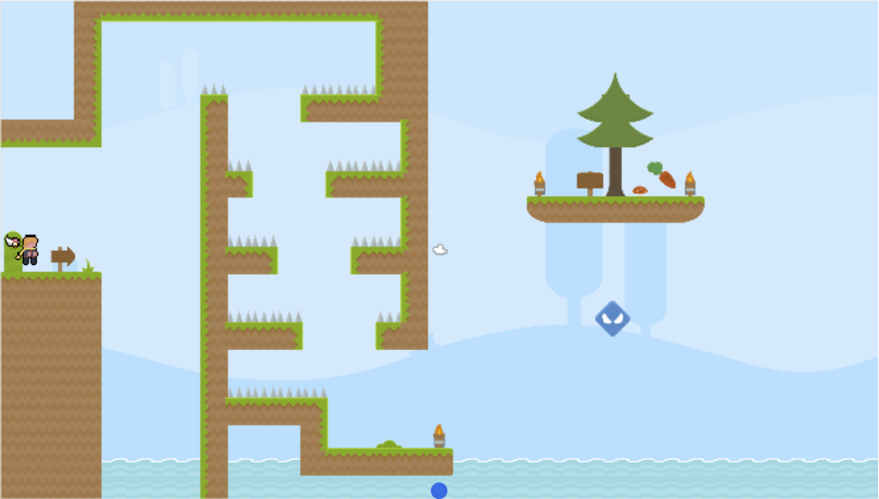
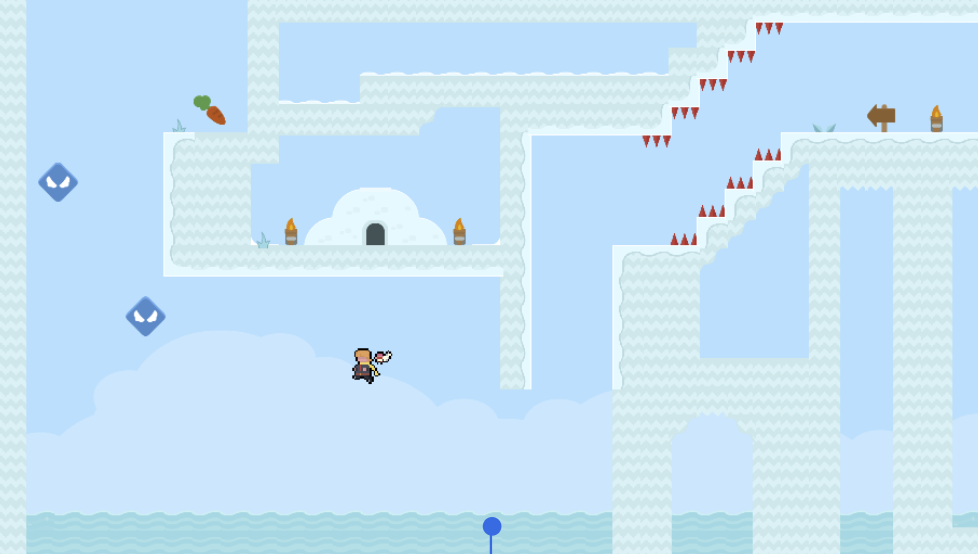
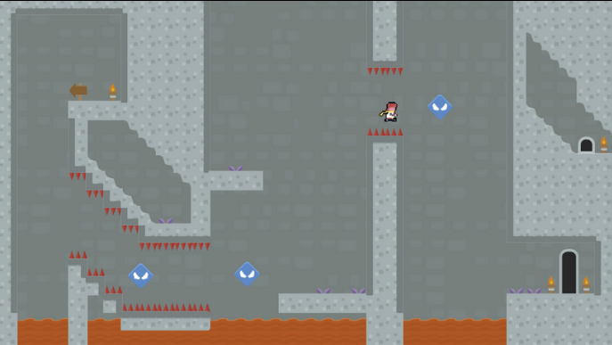

# Odyssey

## Trailer

https://user-images.githubusercontent.com/77242041/156528574-0811a408-c2a9-4fab-97c1-26ae4517c7d4.mp4

## Description
Odessey is a 2D platforming game that I embarked on with my friend for the Orbital project. Odyssey attempts to combines ideas from platformers(such as mario) and visual novels (such as Ace Attornery) to bring you a game that has the best of both worlds.

This was the first software development project/game that we tackled since starting university, so the quality of the game may not be the best. But we still tried our best to make it as fun as possible :D

If you would like to try this game out, just follow the steps listed below.

<ol>
  <li> Download the zip file from the github release page or this link [https://github.com/Imerbear/Odyssey/releases/tag/v1.0] </li>
  <li> Extract the zip file by using your preferred software (E.g. WinZip, WinRar, WindowsExtractor, etc)</li>
  <li> Open the folder produced by the zip file</li>
  <li> Locate the file with the name "Odyssey - Shortcut"</li>
  <li> Double click that shortcut and the game will launch</li>
  <li> Have fun with the game!</li>
</ol>

For more information, visit this [link](https://github.com/Imerbear/Odyssey/blob/main/Odyssey%20Milestone%203%20ReadMe.pdf).

The images found below are some screenshots from the game.

